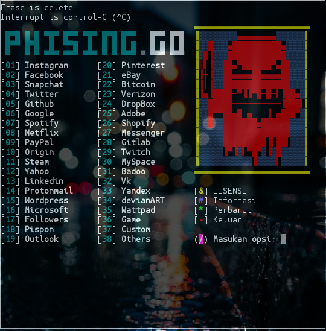

<p align="left">
  <a></a>
 </p>
<p align="center">
  
  PhishingGo tool. phizing is a method of committing fraud by tricking the target with the intention of stealing the target account. Phishing can be said to steal important information by taking over the victim's account for a specific purpose.
</p>
<p align="center">
  <a href="https://www.gnu.org/software/bash/">
    
  </a>
  <a href="https://github.com/stepbystepexe/PhisingGo/blob/master/LICENSE">
    
  </a>
  <a href="https://github.com/stepbystepexe/PhisingGo/releases">
    
  </a>
  <a href="https://github.com/stepbystepexe/PhisingGo/pulls">
    
  </a>
  <a href="https://github.com/stepbystepexe/PhisingGo/projects">
    
  </a>
  <a href="https://github.com/stepbystepexe/PhisingGo/issues">
    
  </a>
  <a href="https://github.com/stepbystepexe/PhisingGo/security/policy">
    
  </a>
  <a href="https://opensource.org">
    
  </a>
</p>
<p align="center">
  Tampilan
</p>
<p align="center">
  
</a>
</p>
<h5>
<p align="center">
  Made with ❤️ by <a href="https://github.com/stepbystepexe">Nedi Senja</a>
</p>
<p align="center">
 
</p>
</h5>

### Informasi:
```text
Nama        : PhisingGo
Versi       : 1.1 (Update: 30 Januari 2020, 3:30 AM)
Tanggal     : 20 Juli 2019
Mod         : Nedi Senja
Tujuan      : Mencuri akun menggunakan metode
              Modern Phising PhisingGo.
Terimakasih : Allah SWT.
              FR13NDS, & seluruh
              manusia seplanet bumi
NB          : Manusia gax ada yang sempurna
              sama kaya yang mod tool ini.
              Silahkan laporkan kritik atau saran
              Ke - Email: d_q16x@outlook.co.id
                 - WhatsApp: https://tinyurl.com/wel4alo

[ Gunakan tool ini dengan bijak ]
```

### Fitur:
+ ip-tracker
+ phising-fage

### Installisasi:
```text
git clone https://github.com/stepbystepexe/PhisinggGo
cd PhisingGo
ls
chmod +x
./phisinggo.sh
```
### Kontak:

<h5> <a href="http://d_q16x@outlook.co.id">Email: d_q16x@outlook.co.id</a>
</h5>
<h5> <a href="https://tinyurl.com/wel4alo">WhatsApp: https://tinyurl.com/wel4alo</a>
</h5>

### LiberaPay:
<noscript><a href="https://liberapay.com/stepbystepexe/donate"></a></noscript>

>**Created by Stepbystep**
